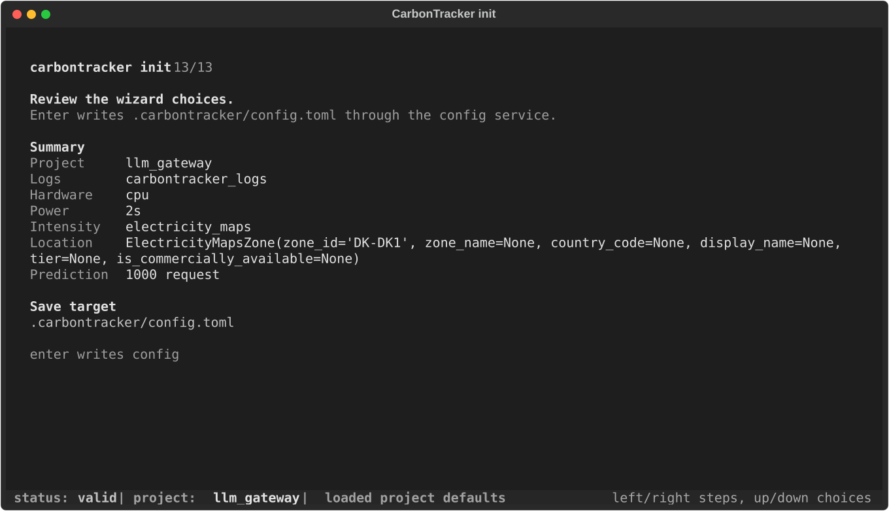
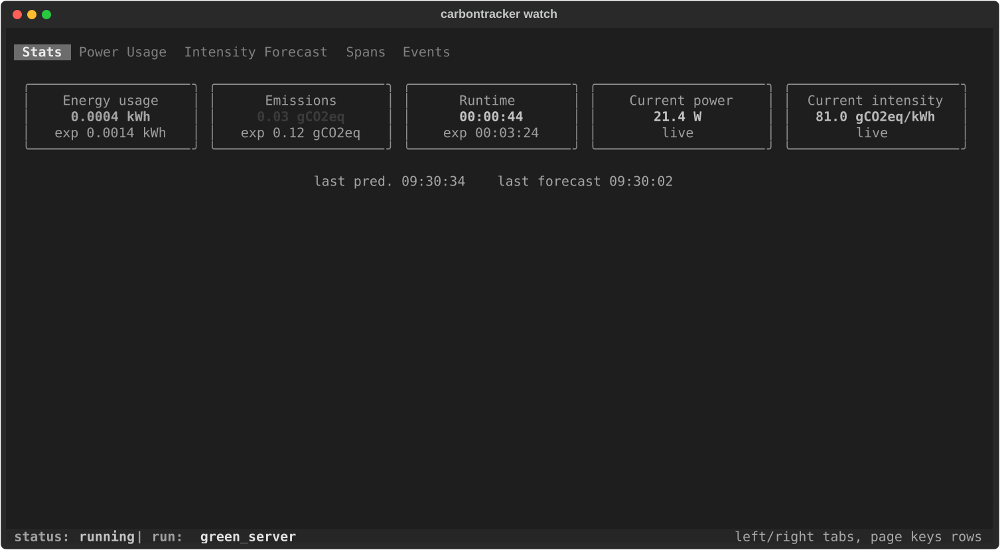
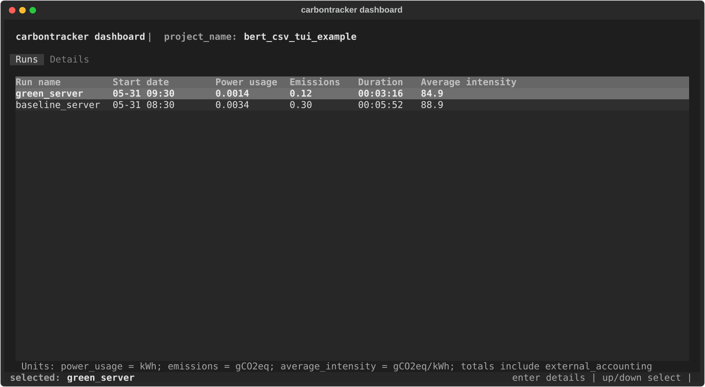

# carbontracker-tui

`carbontracker-tui` is a terminal-first carbon tracking tool for local
experiments, services, scripts, and training jobs.

It keeps the command and Python import simple:

- CLI: `carbontracker`
- Python API: `from carbontracker import CarbonTracker, Component`

Runs are written as structured JSONL event logs. The TUI can inspect one run
with `watch` or compare historical runs with `dashboard`.

## init, watch, track, dashboard

### `carbontracker init`

Create local project defaults in `.carbontracker/config.toml`, or user-level
defaults in `~/.config/carbontracker/config.toml`.

```bash
carbontracker init
```



Useful non-interactive setup:

```bash
carbontracker init \
  --project-name bert_csv_tui_example \
  --log-dir carbontracker_logs \
  --components cpu \
  --components gpu \
  --intensity-method auto \
  --power-sampling-interval 2
```

Global user defaults and provider credentials belong outside the project file:

```bash
carbontracker init --global \
  --location DK-DK1 \
  --pue 1.12 \
  --api-key electricity_maps "$ELECTRICITY_MAPS_API_KEY"
```

### `carbontracker track`

Run a subprocess and write a complete watchable JSONL event log.

```bash
carbontracker track \
  --project-name bert_csv_tui_example \
  --run-name green_server \
  --api-key electricity_maps "$ELECTRICITY_MAPS_API_KEY" \
  --jsonl carbontracker_logs/green_server_events.jsonl \
  -- \
  npm run green_server
```

Use `track` when you want to inspect the run later with `watch` or
`dashboard`. Process stdout and stderr are captured as TUI events and can be
persisted into the watchable log.

### `carbontracker watch`

Open one JSONL run log in the terminal UI.

```bash
carbontracker watch carbontracker_logs/green_server_events.jsonl
```



The watch TUI shows live or replayed run state: energy, emissions, runtime,
current power, current intensity, forecast points, span activity, and process
events.

### `carbontracker dashboard`

Open a terminal dashboard over a directory of `*_events.jsonl` logs.

```bash
carbontracker dashboard carbontracker_logs
```

If no directory is provided, the dashboard uses the configured project log
directory.



The dashboard lists historical runs and derives totals from both measured
session stats and span-level external accounting sidecars.

## Example Code: npm spans and Python API

### Subprocess tracking

Wrap any command:

```bash
carbontracker track \
  --project-name demo \
  --run-name train_once \
  --jsonl carbontracker_logs/train_once_events.jsonl \
  -- \
  python train.py
```

The wrapped process can emit span markers on stdout. In application code, hide
the marker protocol behind small utilities so the server reads like normal
instrumentation.

```bash
npm install express openai

carbontracker track \
  --project-name llm_gateway \
  --run-name summarize_api \
  --components cpu \
  --power-sampling-interval 2 \
  --api-key electricity_maps "$ELECTRICITY_MAPS_API_KEY" \
  --jsonl carbontracker_logs/summarize_api_events.jsonl \
  -- \
  npm run server
```

```json
{
  "type": "module",
  "scripts": {
    "server": "node server.js"
  }
}
```

```js
// carbontrackerMarkers.js
import crypto from "node:crypto";

function emitMarker(payload) {
  process.stdout.write(`carbontracker:${JSON.stringify(payload)}\n`);
}

export async function withCarbonSpan(spanId, fn, options = {}) {
  const parentSpanId = options.parentSpanId ?? "process";
  emitMarker({ type: "start", span_id: spanId, parent_span_id: parentSpanId });

  let result;
  try {
    result = await fn();
    return result;
  } finally {
    const usage =
      typeof options.externalUsage === "function"
        ? options.externalUsage(result)
        : options.externalUsage;
    emitMarker({ type: "stop", span_id: spanId, ...(usage ?? {}) });
  }
}

export async function trackedRequest(handler) {
  const requestSpanId = `request_${crypto.randomUUID().slice(0, 8)}`;
  return withCarbonSpan(
    requestSpanId,
    () =>
      handler({
        span: (name, fn, options = {}) =>
          withCarbonSpan(`${requestSpanId}_${name}`, fn, {
            parentSpanId: requestSpanId,
            ...options,
          }),
      }),
    { parentSpanId: "process" },
  );
}
```

```js
// server.js
import express from "express";
import OpenAI from "openai";
import { trackedRequest } from "./carbontrackerMarkers.js";

const app = express();
const openai = new OpenAI({ apiKey: process.env.OPENAI_API_KEY });

app.use(express.json());

app.post("/summarize", async (request, response, next) => {
  try {
    const payload = await trackedRequest(async (trace) => {
      const prompt = await trace.span("validate_input", async () => {
        if (!request.body.text) throw new Error("text is required");
        return `Summarize this in one sentence:\n\n${request.body.text}`;
      });

      const completion = await trace.span(
        "llm_call",
        () =>
          openai.chat.completions.create({
            model: process.env.OPENAI_MODEL ?? "gpt-4.1-mini",
            messages: [{ role: "user", content: prompt }],
          }),
        { externalUsage: llmExternalUsage },
      );

      return trace.span("render_response", async () => ({
        summary: completion.choices[0].message.content,
        usage: completion.usage,
      }));
    });

    response.json(payload);
  } catch (error) {
    next(error);
  }
});

function llmExternalUsage(completion) {
  const totalTokens = completion?.usage?.total_tokens ?? 0;
  const kwhPerThousandTokens = Number(process.env.LLM_KWH_PER_1K_TOKENS ?? 0);
  const intensity = Number(process.env.LLM_CARBON_INTENSITY_G_PER_KWH ?? 65);

  if (!totalTokens || !kwhPerThousandTokens) return {};

  return {
    external_energy_kwh: (totalTokens / 1000) * kwhPerThousandTokens,
    external_carbon_intensity_g_per_kwh: intensity,
  };
}

app.listen(3000);
```

This gives you local power measurements for the request and nested spans. If the
LLM provider gives you a measured or estimated energy factor, attach it on the
LLM span's stop marker as external usage; if not, omit it and CarbonTracker
will still record the local process power around the API call.

### Python API

Use the Python API when the tracked workload already runs in Python and you want
explicit epoch boundaries.

```python
import time

from carbontracker import CarbonTracker, Component


tracker = CarbonTracker(
    epochs=2,
    project_name="demo",
    run_name="python_training",
    log_dir="carbontracker_logs",
    components=[Component.CPU],
    total_units=2,
    unit_name="epoch",
)

for _ in range(2):
    tracker.epoch_start()
    time.sleep(2)
    tracker.epoch_end()

stats = tracker.finish()
print(stats)
```

Both subprocess and Python API tracking go through the same runtime path and write
the same event model.

## Intensity Provider

Carbon intensity is resolved by `--intensity-method`.

- `auto`: use Electricity Maps when an API key and supported location are
  available, then fall back to a static country average, then a global average.
- `electricity_maps`: require an Electricity Maps API key and a supported
  location.
- `static`: use a fixed value or a static location-based fallback.

Common options:

```bash
carbontracker track \
  --intensity-method auto \
  --location DK-DK1 \
  --api-key electricity_maps "$ELECTRICITY_MAPS_API_KEY" \
  -- \
  python train.py
```

```bash
carbontracker track \
  --intensity-method static \
  --static-carbon-intensity-g-per-kwh 475 \
  -- \
  python train.py
```

Locations can be passed as country codes, Electricity Maps zones, cloud regions,
or latitude/longitude strings depending on the provider path. Project defaults
are resolved through:

1. global config
2. local project config
3. environment variables
4. explicit CLI or API overrides

## Power Measurements

Power sampling is selected from the requested components and available local
providers.

```bash
carbontracker track \
  --components cpu \
  --components gpu \
  --power-sampling-interval 2 \
  --pue 1.12 \
  -- \
  python train.py
```

Supported provider paths include Apple Silicon `powermetrics`, Intel/generic CPU
providers, and NVIDIA GPUs through NVML. NVIDIA support is optional:

```bash
pip install "carbontracker-tui[gpu]"
```

Notes:

- Some providers require local permissions or OS support. On macOS, power
  sampling may require `powermetrics` access.
- If no provider is available for a requested component, CarbonTracker emits
  diagnostics instead of silently inventing measurements.
- `pue` is applied as the power usage effectiveness multiplier.
- Power samples, intensity samples, predictions, spans, and final stats are all
  written to JSONL for later `watch` and `dashboard` inspection.
# carbontracker-tui
# carbontracker-tui
